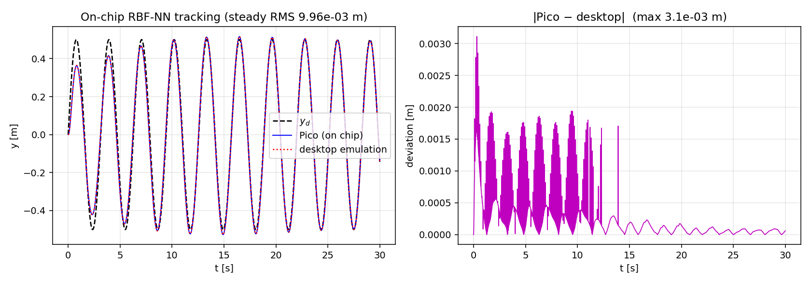

# Mechatronics Systems — Final Project

**Nonlinear Control and Real-Time Digital Implementation**
Adaptive RBF neural-network tracking control and off-policy adaptive dynamic
programming (ADP), with real-time implementation on the Raspberry Pi Pico.

| | |
|---|---|
| **Authors** | Roee Zehavi (209146216), Etay Baron (209438910) |
| **Report** | [`Final_Project_Report.pdf`](Final_Project_Report.pdf) (35 pp., English) |
| **Hardware** | Raspberry Pi Pico (RP2040) @ 200 MHz, MicroPython v1.24.0 + ulab 6.12 |

Two model-free controllers are developed for **one** nonlinear process — a Duffing
mass-spring-damper driven through a first-order force actuator (reused, with re-tuned
parameters, from HW1) — and both are implemented **and measured on the physical Pico**,
with the process simulated in real time on the secondary core.

## Key measured results (on chip)

| Quantity | On chip | Computer reference |
|---|---|---|
| RBF steady-state RMS tracking error | **9.96×10⁻³ m** | 9.98×10⁻³ m (two-core emulation) |
| ADP response vs. fine desktop rollout | within **1.6×10⁻³ m** | — |
| RBF controller update (avg / max) | **2.92 / 2.99 ms** | 19 µs (NumPy proxy) |
| ADP controller update (avg / max) | **0.56 / 0.61 ms** | 2.4 µs (NumPy proxy) |
| Real-time constraint (Ts = 10 ms) | **met, ≈3× margin** (worst tick incl. GC: 8.4 ms) | |



## Layout

```
.
├── Final_Project_Report.pdf   the full report (35 pp.)
├── Py_Code/                Parts 1–3 (desktop, Python: NumPy/SciPy/Matplotlib)
│   ├── plant.py            shared control-affine model  x' = f(x) + g u
│   ├── config.py           all design parameters (single source of truth)
│   ├── part1_analysis.py   Part 1: linearization comparison + Lyapunov  (§2)
│   ├── rbf_adaptive.py     Branch A: continuous adaptive RBF-NN tracking (§3)
│   ├── rbf_discrete.py     Branch A: discrete emulation + sampling sweep (§3)
│   ├── adp_offpolicy.py    Branch B: off-policy ADP policy iteration     (§4)
│   ├── export_pico_params.py   freezes the design into Pico_Code/params.py
│   ├── images/  (generated figures)   data/  (generated adp_policy.npz)
└── Pico_Code/              Part 4 (MicroPython + ulab)
    ├── params.py           frozen constants (auto-generated)
    ├── plant_core1.py      secondary core: scalar RK4 step (paced loop @ dt)
    ├── pico_control.py     main core: RBFController (C3) + ADPController (C4)
    ├── main.py             two-core orchestration (live demo)          [runs on Pico]
    ├── pico_experiment.py  bounded, logged hardware experiment -> CSV  [runs on Pico]
    ├── plot_hw_results.py  on-chip CSV -> report hardware figures (desktop)
    ├── make_arch_figure.py architecture block diagram (desktop)
    ├── desktop_sim.py      off-board validation of the two-core scheme + timing
    └── board_backup/       files found on the course board before flashing
```

## Reproduce the results

Requirements (desktop): Python 3, `numpy`, `scipy`, `matplotlib`.

```bash
cd Py_Code
python3 part1_analysis.py      # §2 figures  -> images/part1/
python3 rbf_adaptive.py        # §3 continuous figures -> images/part2/
python3 rbf_discrete.py        # §3 discrete/sampling figures -> images/part2/
python3 adp_offpolicy.py       # §4 figures -> images/part3/ ; data/adp_policy.npz
python3 export_pico_params.py  # regenerate ../Pico_Code/params.py

cd ../Pico_Code
python3 make_arch_figure.py    # §5 architecture diagram -> ../Py_Code/images/part4/
python3 desktop_sim.py         # §5 Pico validation + timing -> ../Py_Code/images/part4/
```

## Run on the Raspberry Pi Pico

The board runs MicroPython **v1.24.0 with `ulab` 6.12** (pre-built `RPI_PICO.uf2` from
`github.com/v923z/micropython-builder`, flashed via BOOTSEL; plain MicroPython lacks
`ulab`). With the board on `/dev/ttyACM0`:

```bash
pip install mpremote
cd Pico_Code
mpremote cp params.py plant_core1.py pico_control.py main.py pico_experiment.py :

# live demo (1 Hz status prints; MODE = "rbf" | "adp" at the top of main.py)
mpremote run main.py

# logged experiments -> CSV captures used by the report's Section 5
mpremote exec "import pico_experiment as E; E.run('rbf', 30.0)" > ../Py_Code/data/pico_hw_rbf.csv
mpremote exec "import pico_experiment as E; E.run('adp',  8.0)" > ../Py_Code/data/pico_hw_adp.csv
python3 plot_hw_results.py     # -> images/part4/pico_hw_*.png + all Section-5 numbers
```

The controller must finish each update below `Ts = 10 ms`; measured on chip (200 MHz):
RBF avg/max 2.92/2.99 ms, ADP 0.56/0.61 ms.

## Report section ↔ assignment map

| Report | Code | Work items |
|--------|------|---------|
| §2 Process model & analysis   | `plant.py`, `part1_analysis.py`        | 1.1–1.7 |
| §3 Adaptive RBF-NN tracking   | `rbf_adaptive.py`, `rbf_discrete.py`   | A1–A5 |
| §4 Off-policy ADP             | `adp_offpolicy.py`                     | B1–B8 |
| §5 Raspberry Pi Pico          | `Pico_Code/*`, `desktop_sim.py`        | C1–C5 |

## Note on the process parameters

The process **structure** (Duffing spring + first-order actuator) and the mass /
stiffness / actuator gain are from HW1. Three parameters are re-tuned for the project
(as the spec permits): actuator lag `tau` 0.05→0.2 s, cubic stiffness `k3` 5→40,
damping `c1` 4→1. This makes the process strongly nonlinear at a moderate amplitude,
lightly damped (so the optimal regulator clearly beats doing nothing), and keeps the
unknown drift of moderate magnitude — well conditioned for the RBF/ADP designs and the
Pico numeric range. See the header of `plant.py`.
